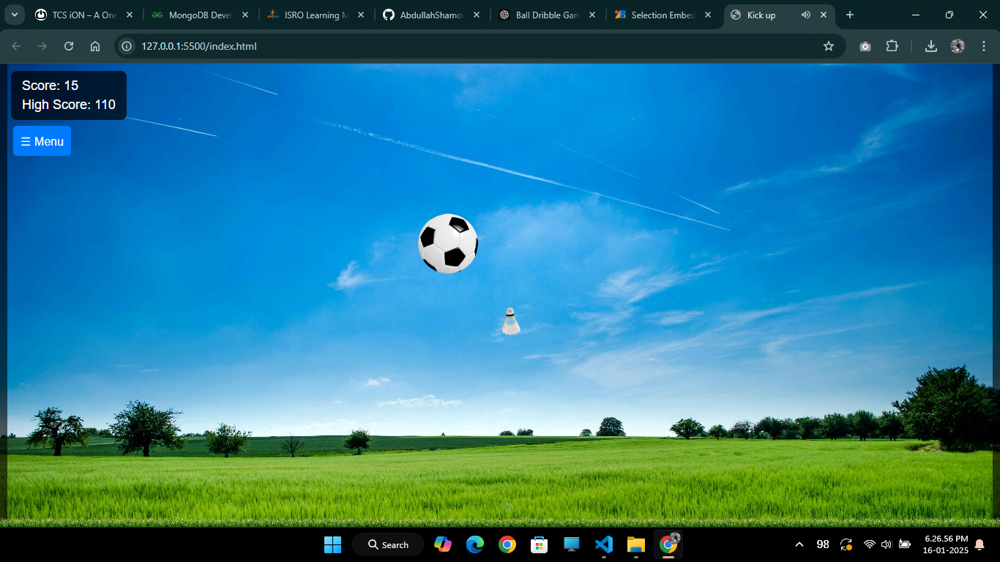
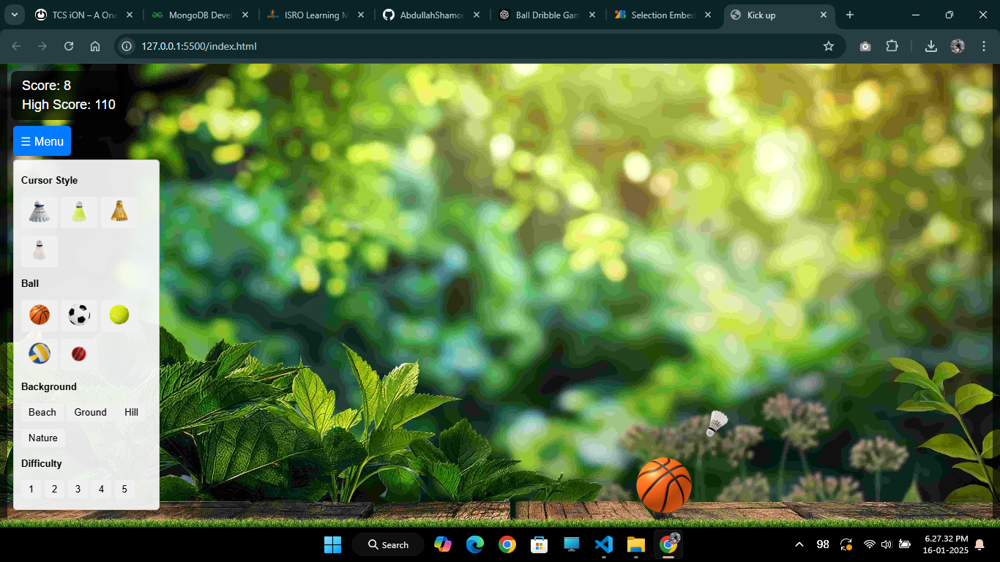

# Kick Up

**Kick Up** is an interactive, fun game where you use your mouse to bounce a ball off the ground as many times as possible. Each successful bounce adds to your score, and if the ball falls to the ground, the game ends. The ball will bounce in the opposite direction depending on where the mouse cursor hits it, making the game both challenging and exciting.

## How to Play

1. Use your mouse cursor to **bounce the ball** by touching it.
2. Each bounce increases your score by **1 point**.
3. The ball will bounce in different directions depending on where it is hit (bottom-left, bottom-right, etc.).
4. **Don't let the ball fall on the ground**—if it does, the game is over.
5. Press **Restart** to play again after the game ends.

## Features

- **Bounce mechanics**: The ball bounces off the mouse cursor, with the direction determined by the point of contact.
- **Score tracking**: The score increases with each bounce and is displayed at the top of the screen.
- **Sound effects**: Enjoy sound effects when the ball hits the cursor or walls and when the ball falls to the ground.
- **Highscore tracking**: Your highest score is saved locally and displayed when you restart the game.

## Screenshots

## Technologies Used

- **HTML**: For the game structure.
- **CSS**: For styling the game layout and elements.
- **JavaScript**: For the game logic, including ball movement, collision detection, scorekeeping, and more.

## Future Improvements

- Add more levels and difficulty options.
- Implement a leaderboard for top scores.
- Include more sound effects (e.g., background music).
- Enhance the visual design with animations or particle effects.
***and Many More...***